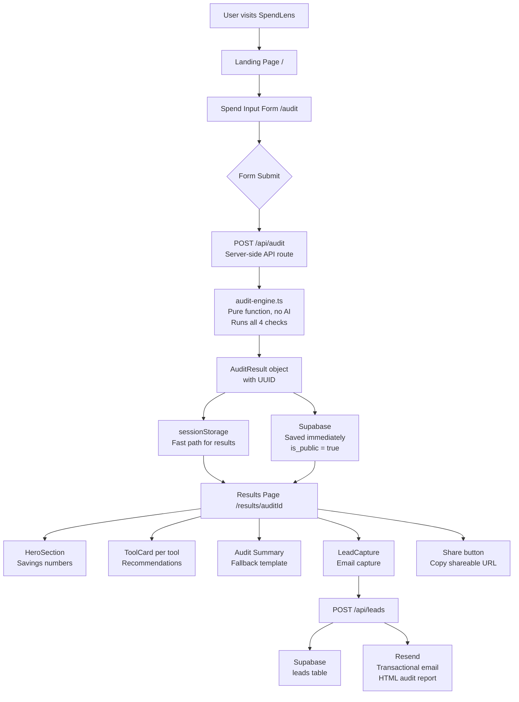

# ARCHITECTURE.md

## System Diagram

---

## Data Flow

1. **User fills form** → `FormData` object built in browser with localStorage persistence
2. **Form submits** → `POST /api/audit` called from `SpendForm/index.tsx`
3. **Server runs audit** → `runAudit(formData)` pure TypeScript function, returns `AuditResult` with UUID
4. **Audit saved immediately** → inserted into Supabase `audits` table with `is_public = true` before user sees results
5. **Result stored** → `sessionStorage` used as fast path to pass data to results page without extra round-trip
6. **Results page loads** → reads sessionStorage first; if empty (shared link, new tab, refresh) fetches from Supabase by ID
7. **Lead capture** → on email submit, `POST /api/leads` saves lead to Supabase `leads` table + sends HTML email via Resend
8. **Shareable URL** → `/results/[auditId]` always works — loads from Supabase, strips PII

---

## Why Next.js 14 App Router

- **Server components** for the landing page mean zero JS sent to client for static content
- **Dynamic routes** (`/results/[auditId]`) handle shareable URLs natively
- **API routes** used for audit processing and lead capture — keeps service role key server-side only
- **Vercel deployment** is one command with zero config
- TypeScript support is first-class

Considered Vue + Vite but Next.js won on deployment simplicity and the App Router's server/client component split which matters for Lighthouse scores.

---

## Why Supabase

- Free tier handles the expected load for an MVP
- Postgres under the hood — real relational DB, not a toy
- Row Level Security enabled — public audits readable without auth, leads protected
- SDK works seamlessly with Next.js App Router
- No vendor lock-in — standard Postgres can be migrated anywhere

Two clients in use: browser client (anon key, client-side) for fetching public audits on the results page, and service role client (server-side only, inside API routes) for inserts.

---

## Why the Audit Engine Has No AI

The audit logic is deterministic:
- $20 < $100 is always true
- 1 seat < 2 seat minimum is always a mismatch
- Two coding assistants is always redundant
- API spend under $20/month is always cheaper on a chat plan

Using an LLM for this introduces hallucination risk, latency, and cost with zero upside. AI is used exactly once — for the personalized summary paragraph — because that is the only place where natural language generation adds value that rules cannot replicate.

---

## API Routes

| Route | Method | Purpose |
|-------|--------|---------|
| `/api/audit` | POST | Runs audit server-side, saves to Supabase, returns result |
| `/api/leads` | POST | Saves lead to Supabase, sends HTML email via Resend |

---

## Environment Variables

| Variable | Where Used |
|----------|-----------|
| `NEXT_PUBLIC_SUPABASE_URL` | Client + Server |
| `NEXT_PUBLIC_SUPABASE_PUBLISHABLE_KEY` | Client (results page fetch) |
| `SUPABASE_SERVICE_ROLE_KEY` | Server only (API routes) |
| `RESEND_API_KEY` | Server only (/api/leads) |
| `NEXT_PUBLIC_APP_URL` | Server (email report URL) |
| `ANTHROPIC_API_KEY` | Reserved for future AI summary |
