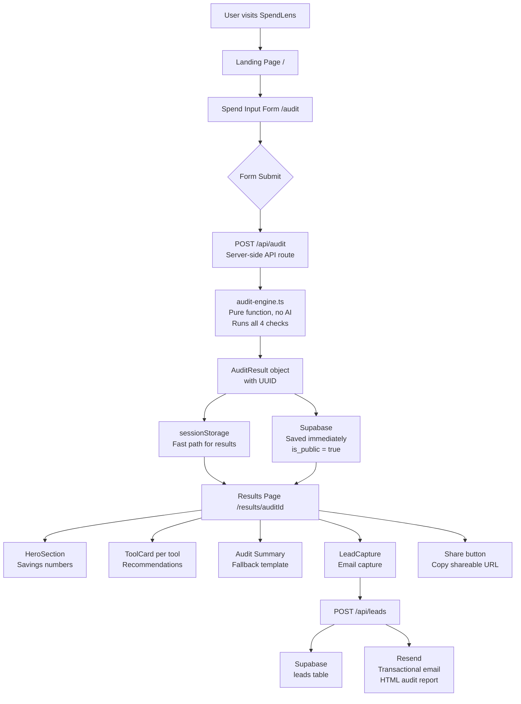

# SpendLens — Free AI Spend Audit for Startups

SpendLens helps startup founders and engineering managers find out exactly where they're overspending on AI tools. Enter your current subscriptions, get an instant audit with specific savings recommendations, and share your report with your team.

**Live URL:** https://credex-audit-alpha.vercel.app

---

## System Diagram



---

## Quick Start

### Install

```bash
git clone https://github.com/riya-kaurav/spendlens.git
cd ai-audit
npm install
```

### Environment Variables

| Variable | Where Used |
|----------|-----------|
| `NEXT_PUBLIC_SUPABASE_URL` | Client + Server |
| `NEXT_PUBLIC_SUPABASE_PUBLISHABLE_KEY` | Client (results page fetch) |
| `SUPABASE_SERVICE_ROLE_KEY` | Server only (API routes) |
| `RESEND_API_KEY` | Server only (/api/leads) |
| `NEXT_PUBLIC_APP_URL` | Server (email report URL) |


### Run Locally

```bash
npm run dev
```

Open http://localhost:3000

### Run Tests

```bash
npm test
```

### Deploy

```bash
vercel --prod
```

---


## Tech Stack

- **Framework:** Next.js 14 (App Router) + TypeScript
- **Styling:** Tailwind CSS
- **Database:** Supabase (Postgres)
- **Deployment:** Vercel
- **Testing:** Vitest
- **CI:** GitHub Actions
 
---

## Data Flow

1. **User fills form** → `FormData` object built in browser with localStorage persistence
2. **Form submits** → `POST /api/audit` called from `SpendForm/index.tsx`
3. **Server runs audit** → `runAudit(formData)` pure TypeScript function, returns `AuditResult` with UUID
4. **Audit saved immediately** → inserted into Supabase `audits` table with `is_public = true` before user sees results
5. **Result stored** → `sessionStorage` used as fast path to pass data to results page without extra round-trip
6. **Results page loads** → reads sessionStorage first; if empty (shared link, new tab, refresh) fetches from Supabase by ID
7. **Lead capture** → on email submit, `POST /api/leads` saves lead to Supabase `leads` table + sends HTML email via Resend
8. **Shareable URL** → `/results/[auditId]` always works — loads from Supabase, strips PII

---


---

## API Routes

| Route | Method | Purpose |
|-------|--------|---------|
| `/api/audit` | POST | Runs audit server-side, saves to Supabase, returns result |
| `/api/leads` | POST | Saves lead to Supabase, sends HTML email via Resend |

---

